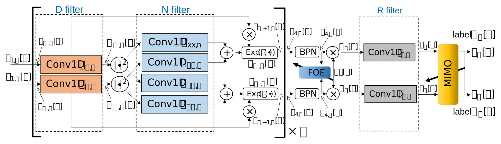

# Generalized DBP - Combined Deep Learning and Adaptive DSP Training

This repository contains the source code and supplementary materials for the paper:

> **Combined Neural Network and Adaptive DSP Training for Long-Haul Optical Communications**
> Qirui Fan, Chao Lu, Alan Pak Tao Lau
> IEEE Journal of Lightwave Technology, 2021
> [DOI: 10.1109/JLT.2021.3111437](https://ieeexplore.ieee.org/abstract/document/9534655)

## Overview

<p align="center">
  
</p>
<p align="center"><em>The NN GDBP and adaptive DSP structure: Conv1D (1-D convolution), BPN (batch power normalization), MIMO (multiple-input-multiple-output filters), FOE (frequency offset estimator).</em></p>

We propose a novel "stateful neural network" layer framework that integrates adaptive DSP algorithms with standard batch-based backpropagation training. This approach enables joint optimization of neural network parameters and adaptive filters for optical signal processing.

For a detailed walkthrough with reproducible results, see our [extended web article](https://remifan.github.io/gdbp_study/article.html).

## Dependencies

This project depends on [commplax](https://github.com/remifan/commplax), a JAX-based differentiable DSP library for optical communications.

**Important:** This code is compatible with [commplax v0.1.1](https://github.com/remifan/commplax/tree/v0.1.1). Later versions of commplax have undergone significant changes and may not be compatible.

The required package versions (pinned in commplax v0.1.1):
| Package | Version |
|---------|---------|
| jax     | 0.2.13  |
| jaxlib  | 0.1.66  |
| flax    | 0.3.4   |

To install the correct version:
```bash
pip install git+https://github.com/remifan/commplax.git@v0.1.1
```

## Installation

```bash
git clone https://github.com/remifan/gdbp_study.git
cd gdbp_study
pip install -e .
```

## Citation

If you find this work useful, please cite:
```bibtex
@article{fan2021combined,
  title={Combined Neural Network and Adaptive DSP Training for Long-Haul Optical Communications},
  author={Fan, Qirui and Lu, Chao and Lau, Alan Pak Tao},
  journal={Journal of Lightwave Technology},
  volume={39},
  number={22},
  pages={7083--7091},
  year={2021},
  publisher={IEEE},
  doi={10.1109/JLT.2021.3111437}
}
```